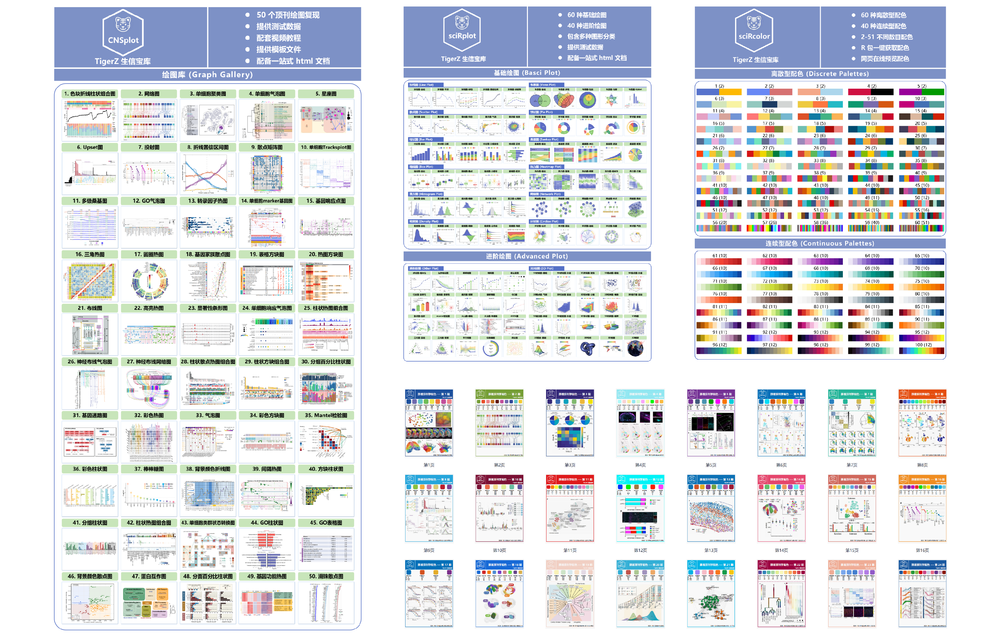
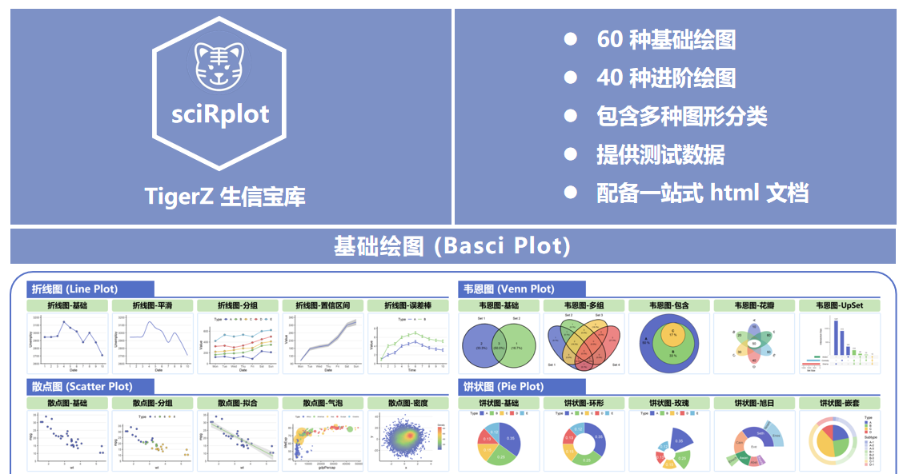
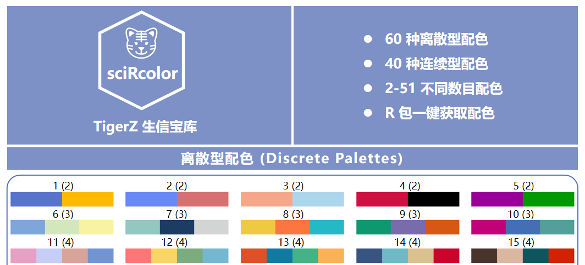
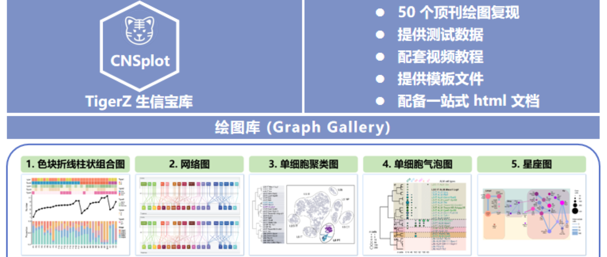
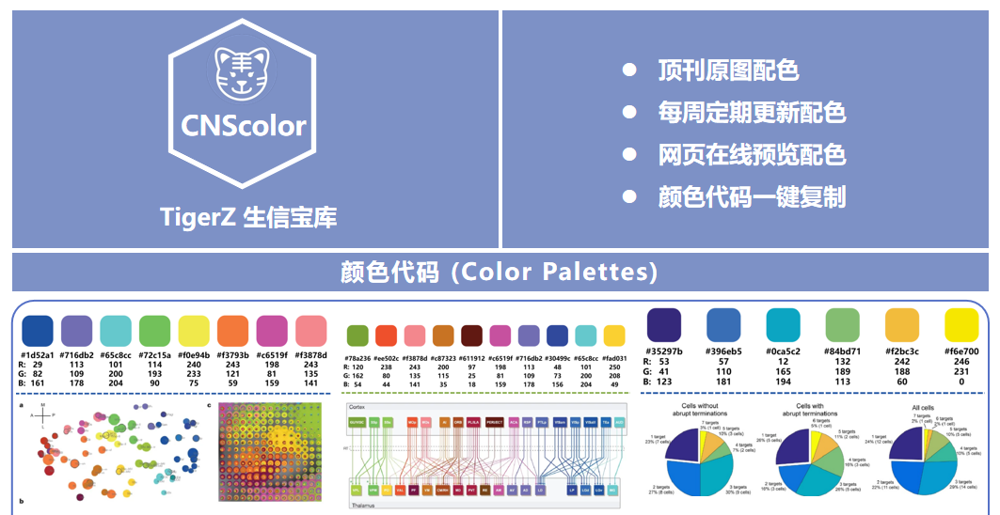

# PlotOnePiece: TigerZ 生信宝库科研绘图资源合集

目前，**TigerZ生信宝库**已经推出了很多科研绘图相关的资源，也受到了很多小伙伴的支持和喜爱。为了便于大家获取所有绘图资源，`PlotOnePiece`项目正式启动！`PlotOnePiece`珍藏了**TigerZ生信宝库**的所有绘图资源，想要我的宝藏吗？我把它们全部都放在了这里🏴‍☠️。

`PlotOnePiece`目前包含了以下绘图资源，点击每个页面中的小卡片即可跳转到对应公众号文章链接。

详细信息见下文：

## 1. sciRplot

`sciRplot`项目用于解决R语言中科研绘图的问题，包含了**100**种绘图代码（**60**种基础绘图+**40**种进
阶绘图）。详细信息见：

## 2. sciRcolor

`sciRcolor` 项目用于解决 R 语言科研绘图中颜色选择的问题，包含了 **100** 种常用配色（**60** 种离散
色 + **40** 种连续色）。详细信息见：

## 3. CNSplot

`CNSplot` 项目专门针对科研绘图中的高级复杂图形，包含了 **50** 个顶刊绘图复现。详细信息见：

## 4. CNScolor

`CNScolor` 项目是一个开源免费的配色项目，收集了顶刊绘图中的**颜色代码**，每周通过 TigerZ 生信宝库
发布推文。并且通过一个**在线网站**进行展示。详细信息见：

## 5. 更多

更多内容请扫描下方二维码

或者微信搜索公众号 <strong>TigerZ 生信宝库</strong>

每天分享数据可视化、生信分析相关知识哦！

 

{width=75%}

